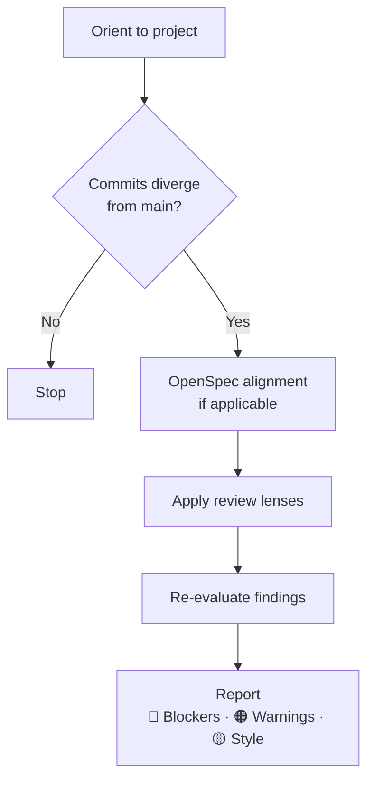
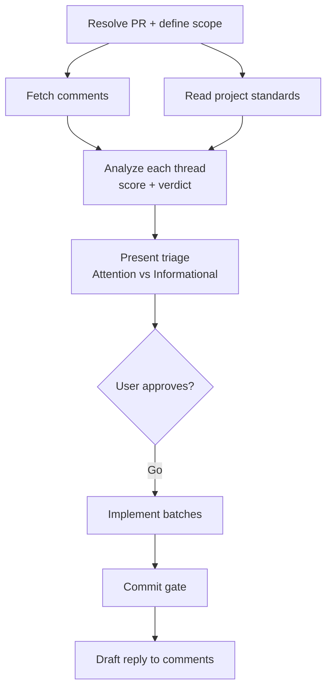
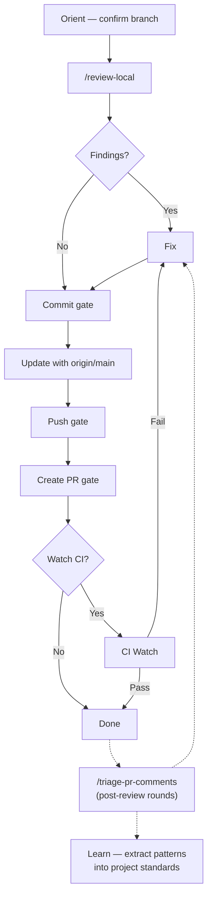

# Claude Skills

A collection of reusable [Agent Skills](https://github.com/anthropics/skills) for Claude Code.

## Skills

| Skill                                                     | Description                                                                                                                                      |
| --------------------------------------------------------- | ------------------------------------------------------------------------------------------------------------------------------------------------ |
| [review-local](/skills/review-local/SKILL.md)             | Pre-PR self-review of local commits against origin/main. Adapts to the project's stack and conventions.                                          |
| [triage-pr-comments](/skills/triage-pr-comments/SKILL.md) | Triage PR review comments with structured verdicts (AGREE, DECLINE, DISCUSSION NEEDED, etc.) and a prioritized action plan. Invoke explicitly.   |
| [start-pr-cycle](/skills/start-pr-cycle/SKILL.md)         | Full PR workflow — review, fix, commit, push, and create PR — in a single guided session with hard confirmation gates at each irreversible step. |

**Important:**

- `review-local` and `triage-pr-comments` are self-contained — install and use them independently
- `start-pr-cycle` orchestrates both and requires them to be installed.

## Prerequisites

These skills assume the following tools are installed and available on `PATH`:

| Tool                                               | Required                           | Used by                                |
| -------------------------------------------------- | ---------------------------------- | -------------------------------------- |
| [git](https://git-scm.com/)                        | Yes                                | All skills                             |
| [GitHub CLI (`gh`)](https://cli.github.com/)       | Yes                                | `start-pr-cycle`, `triage-pr-comments` |
| [jq](https://jqlang.github.io/jq/)                 | Yes                                | `triage-pr-comments`                   |
| [OpenSpec](https://github.com/anthropics/openspec) | No — used conditionally if present | `review-local`, `start-pr-cycle`       |

## Installation

Install a single skill with `npx skills`:

```bash
npx skills add https://github.com/acatl/some-skills --skill review-local
npx skills add https://github.com/acatl/some-skills --skill triage-pr-comments
npx skills add https://github.com/acatl/some-skills --skill start-pr-cycle
```

## Usage

Skills load automatically in Claude Code based on task context. No explicit invocation needed — just describe your task and Claude will pick up the relevant skill.

## Structure

Each skill follows the [Agent Skills standard](https://agentskills.io):

```txt
skills/
└── skill-name/
    ├── SKILL.md    # Required: YAML frontmatter + instructions
    └── ...         # Optional: templates, scripts, examples
```

## Skill Description

### /review-local

Pre-PR self-review of local commits against `origin/main`. Adapts to whatever stack the project uses — reads `CLAUDE.md`, package manifests, and architecture docs to calibrate which review lenses apply. Produces a structured report with severity-classified findings (Blocker / Warning / Style) and a merge recommendation.



### /triage-pr-comments

Structured triage of PR review comments from teammates, Copilot, or external reviewers. Scores each comment thread against five dimensions (Technical Validity, Architecture Alignment, Convention Compliance, Practical Impact, YAGNI) and assigns a deterministic verdict. Produces a prioritized action plan with batched implementation. Invoke explicitly: `/triage-pr-comments #<pr-number>`.



### /start-pr-cycle

End-to-end PR workflow with hard confirmation gates at every irreversible step. Orchestrates `/review-local` for pre-PR review and `/triage-pr-comments` for post-review rounds. Nothing is committed, pushed, or created without explicit user approval.


